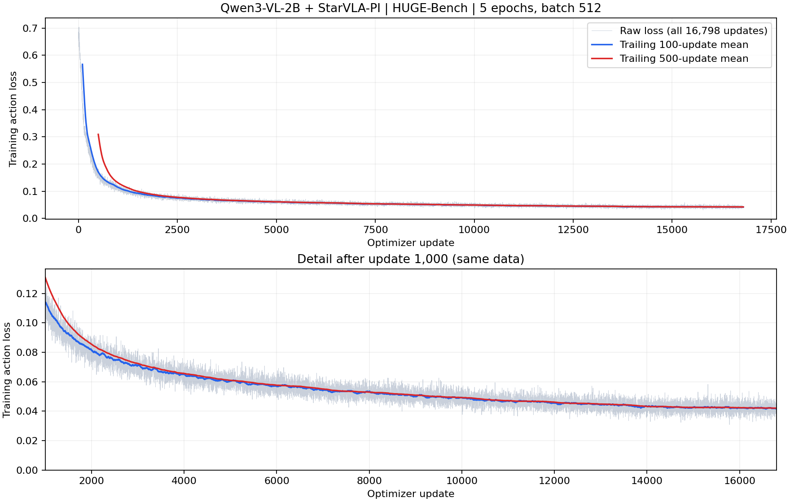
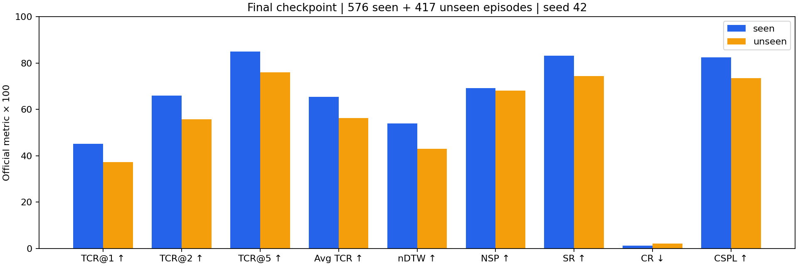
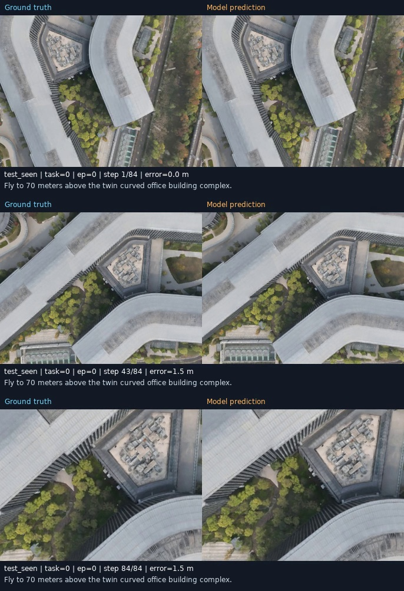

# Qwen3-VL-2B + StarVLA-PI：HUGE-Bench 完整实验结果

Run：`hugebench_qwen3vl2b_5ep_b512_20260916`。训练与正式测试已完成。
这里展示原 2B VLA 的结果；后续 RefDrone VLM 替换实验尚未在此归档最终成绩。

## 训练

| 数据帧 | GPU | 全局 batch | 更新次数 | 累计样本 | epoch | seed |
|---:|---|---:|---:|---:|---:|---:|
| 1,720,096 | 4 × A100 80GB | 512 | 16,798 | 8,600,576 | 5.000056 | 42 |

5 epoch 按完整 batch 向上取整，多 96 个样本。
VLM、projector、action head 联合更新；没有单独记录验证 loss。
完整配置见 [config.full.yaml](training/config.full.yaml)，全部 16,798 条结构化日志见
[metrics.jsonl](training/metrics.jsonl)（约 6.4 MB，可用 GitHub Raw 下载）。

| 首步 loss | 最后一步 loss | 最后 100 步均值 | 最后 500 步均值 | 最后 1,000 步均值 |
|---:|---:|---:|---:|---:|
| 0.654538 | 0.042198 | 0.041669 | 0.042095 | 0.042164 |



每个原始点是一次 optimizer update 内 16 个 microbatch、四卡平均的 action flow-matching loss。
100 和 500 指向前回看 100/500 次更新的移动平均窗口；图中包含全部原始点。
下图区域放大第 1,000 步后的同一数据。loss 全部有限、步数连续；较低训练 loss 不等同于测试泛化。

## 正式测试

使用最终 checkpoint、`seed=42`，完整覆盖 576 条 seen 和 417 条 unseen 轨迹。
指标由官方 HUGE-Bench `metric.py` 计算，版本为
`e80e8ac6c39b7503aea31d9c288d24591c0a0a79`，无轨迹截断或下采样。
以下数值为官方指标 ×100；CR 越低越好，其余越高越好。

### Seen（576 条）

| TCR@1 | TCR@2 | TCR@5 | Avg. TCR | nDTW | NSP | SR | CR ↓ | CSPL |
|---:|---:|---:|---:|---:|---:|---:|---:|---:|
| 45.14 | 65.95 | 84.85 | 65.32 | 53.83 | 69.19 | 83.16 | 1.22 | 82.37 |

### Unseen（417 条）

| TCR@1 | TCR@2 | TCR@5 | Avg. TCR | nDTW | NSP | SR | CR ↓ | CSPL |
|---:|---:|---:|---:|---:|---:|---:|---:|---:|
| 37.29 | 55.64 | 76.05 | 56.33 | 42.92 | 68.16 | 74.34 | 2.16 | 73.53 |



SR 使用终点距离 20 m 阈值，不能单独表示精确到达或无碰撞。
这是单个最终 checkpoint、单个 seed 的结果，4 轨迹 smoke 测试不计入。

### 原始指标与验证

- [官方完整 metrics.json](evaluation/metrics.json)：overall、seen/unseen、8 类任务和全部 993 条逐轨迹结果。
- [逐轨迹 CSV](evaluation/per_episode_metrics.csv)：便于筛选、重新分组，包括 SPL、轨迹长度和采样数。
- [按任务 CSV](evaluation/per_task_metrics.csv)、[终点统计](evaluation/endpoint_records.json)。
- [评测配置](evaluation/run_config.json)：`exec_steps=10`、`smooth_overlap=true`、`yaw_legacy`；两组 renderer/policy 使用四卡。
- [轨迹审计](evaluation/rollout_audit.json)：993 个 ID 完整且不重复，GT 与数据源一致，预测/GT 有限且完整，终点 SR 独立核对一致。
- [原文件 SHA256 清单](archive_manifest.json)：复制原始记录时保持内容不变，历史路径用于来源追溯。

最终 checkpoint SHA256：`8ad5b7ef8a0f4a0cce299b0a9a69741a7c94786ee7b5a750e18d6fec7ea4825d`，大小 5,839,846,728 字节。
权重未放入 Git。原始轨迹保存在本机结果目录；本归档保留其指标和校验信息。

## 视频

993 条轨迹视频全部生成，共 339,394 帧，5 FPS，左侧 GT、右侧预测。
见 [完成记录](evaluation/video_summary.json)、[逐轨迹清单](evaluation/video_manifest.json) 和四个 worker 完成记录。
评测时 `save_video=false`，视频是在原评测目录中后补渲染，不重新推理。



视频保留在服务器：

```text
/root/workspace-ll/experiments/starvla_pi_qwen3vl_2b/results/
  hugebench_qwen3vl2b_5ep_b512_20260916/pytorch_model/full_seed_42/
  rollouts/task_*/test_*/*/episode_*/gt_pred_side_by_side.mp4
```

重渲染已有轨迹：

```bash
bash scripts/render_eval_videos.sh --eval-dir /absolute/path/to/full_seed_42
```

## 重建图表

在实验目录中使用兼容环境运行；无需 GPU、模型权重或原始数据：

```bash
source scripts/lib/common.sh
"$VENV_ROOT/bin/python" scripts/tools/summarize_records.py
```

脚本检查步数、有限 loss、评测唯一 ID 及逐轨迹均值与 seen/unseen 官方汇总的一致性，再生成图表和 CSV。
这次归档没有重新训练或重新计算闭环轨迹，也不声称重新克隆的环境会逐位复现历史输出。
